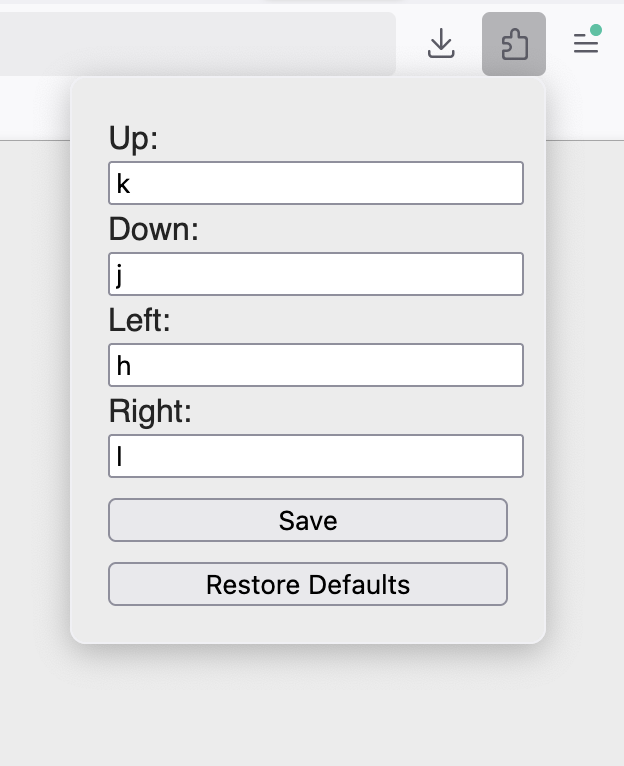

# hjkl

I was looking for a **simple** firefox extension to add *minimal* vim-like navigation to webpages.

New in version 1.1: configurable keys (see screenshot).

I already knew a lot of firefox shortcuts, so I didn't want to have to re-learn them all, I just wanted to add hjkl
navigation so I don't have to use the arrow keys or my mouse to scroll a page.

## Installation

You can find the addon page here: https://addons.mozilla.org/firefox/addon/vim-hjkl/

## Screenshot

